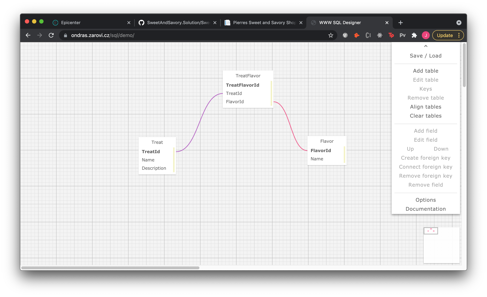

# Jesse's Pierre's Sweet and Savory Shop
https://github.com/jessecallahan/SweetAndSavory.Solution

Created 06.19.21 
By _**Jesse Callahan**_ 
Contact: _**Jessetylercallahan@gmail.com**_ 

## Description
Pierre's Sweet and Savory Shop is a C# application in the .NET MVC Framework that utilizes a local sql database. This application simulates a Factory database, where an owner can see all the Treats and Flavors they belong to. The database utilizes a many to many relationship. This project also utilizes authentication and authorization using Identity. 

Each Registered User has access to all CRUD functionality. However if you are not signed in you can see the splash page. To see what Treats and Flavors you have created as a User navigate to the treats or flavors index pages and click 'go to list of treats/flavors created by this user'.

## Setup/Installation Requirements

1. Clone this [repository](https://github.com/jessecallahan/SweetAndSavory.Solution)
2. From the project directory folder (SweetAndSavory) create a 'appsettings.json' file 
3. First, Copy this into the appsettings.json file:    `{
    "ConnectionStrings": {
        "DefaultConnection": "Server=localhost;Port=3306;database=sweetandsavory;uid=root;pwd=[YOUR-PASSWORD-HERE];"
    }
}`    *[YOUR-PASSWORD-HERE] is your sql password*
4. Now, from the project directory folder use command 'dotnet restore' in your terminal to load boilerplate
5. Next, use command 'dotnet ef database update' to publish your sql using the migrations folder. If everything works correctly, you should see a new sql database schema called sweetandsavory in your workbench.
6. From the project directory folder use command 'dotnet run' in your terminal to run server
7. Copy the local host 5000 server link into your perferred web browser
8. Enjoy!

## Specs
BELOW IS A SCHEMA CHART

## Technologies Used
* C#
* MySql
* Entity Framework
* .NET
* MVC
* CSS/HTML
* Identity

## License
Creative Commons license 

